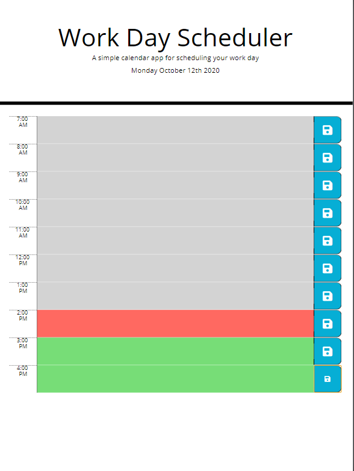
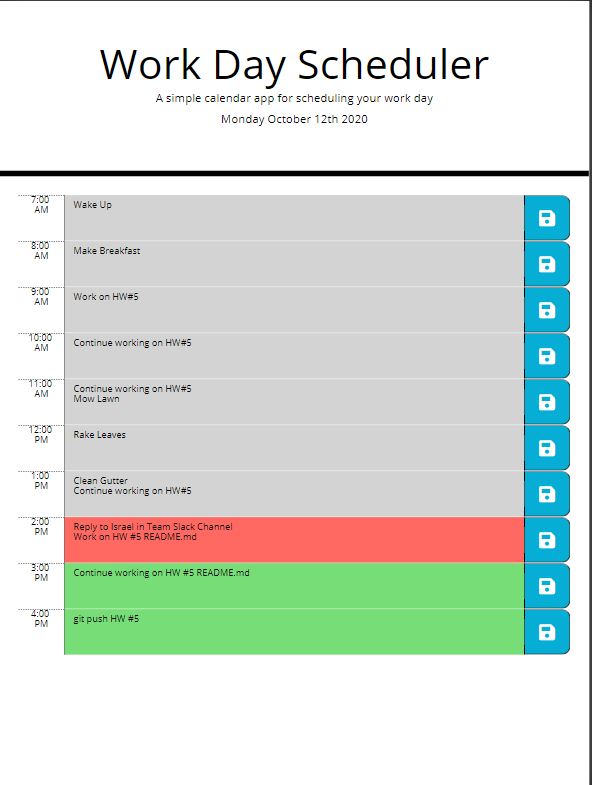
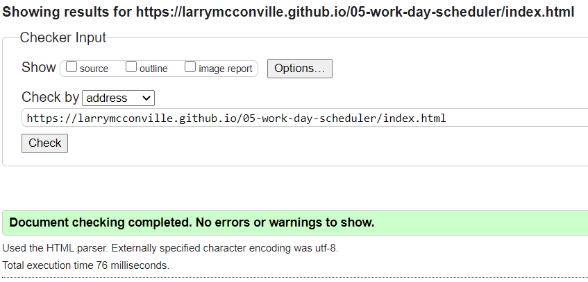

# [**05-WORK-DAY-SCHEDULER**](https://larrymcconville.github.io/05-work-day-scheduler/) :link:

## Project Goal

Create a daily planner which presents the current business day. When opened,
Standard business hours should be presented such as 7 - 4, 8 - 5, 9 - 6, and the day should be presented in one hour blocks with the ability to enter schedule events accordingly.

The time blocks will be color coded to present `Past`, `Present` and `Future` time periods.
Past hours will be `Gray`, the current hour will be `Red` and future hours will be `Green`.
When a time block is selected the user can enter a new event or update a current event. Clicking the save icon will save the event to local storage; when the application launches it will load the stored schedule.

This app will run in the browser and feature dynamically updated HTML and CSS powered by jQuery.

The [Moment.js](https://momentjs.com/) library should be utilized to work with date and time in the browser.

## User Story

```
AS AN employee with a busy schedule
I WANT to add important events to a daily planner
SO THAT I can manage my time effectively
```

## Acceptance Criteria

```
GIVEN I am using a daily planner to create a schedule
WHEN I open the planner
THEN the current day is displayed at the top of the calendar
WHEN I scroll down
THEN I am presented with time blocks for standard business hours
WHEN I view the time blocks for that day
THEN each time block is color-coded to indicate whether it is in the past, present, or future
WHEN I click into a time block
THEN I can enter an event
WHEN I click the save button for that time block
THEN the text for that event is saved in local storage
WHEN I refresh the page
THEN the saved events persist
```

## Solution

All of the application development has been performed in JavaScript utilizing jQuery to work with the DOM. The design intent was to leverage the DRY principle whereby the `creation` of all DOM elements, as well as the `setting`, `getting` and `saving`, all occurs in the JavaScript code.

### init()

- Sets current date at top of page
- Calls renderSchedule()

### renderSchedule()

- Loops through `businessHours` array for the defined work day.
- Utilizes jQuery to define and dynamically build all necessary `HTML` page elements.
- Pass hour from `businessHours` array to `getHourTense()`

### getHourTense()

- Receives the current `businessHours` element from `renderSchedule()`
- Evaluates the `hour` against `moment().format("HH")` and sets `hourTense` equal to `.past`, `.present`, or `.future`
- Returns `hourTense`

### getSchedule()

- Retrieves `schedule` from local storage
- Evaluates if `schedule` is empty
- Loops through `schedule` and loads DOM elements for stored schedule

### saveSchedule()

- Defines a `newSchedule` object with the hour and event
- Pushes the `newSchedule` object to the `schedule` array
- Sets local storage inclusive of the new object

### .saveBtn

- Captures the `"button-index"` attribute
- Calls `saveSchedule()` passing `buttonIndex`
- Calls `getSchedule()` to refresh DOM

## HTML

The base html was modified to add id="row-parent" to the container. This serves as the anchoring parent for the dynamic elements.

## CSS

The base css was modified to include a media query to set specific element width constraints @480 pixels to provide a better experience for mobile devices.

## Application Screen Shot




## Mock-Up

The following animation demonstrates the application functionality:


## Validation

The application HTML was scanned with the [Markup Validation Service](https://validator.w3.org/).


## Sources Referenced

[w3schools](https://www.w3schools.com/html/) `|` [stack**overflow**](//https://stackoverflow.com/questions/3304014/how-to-interpolate-variables-in-strings-in-javascript-without-concatenation)
